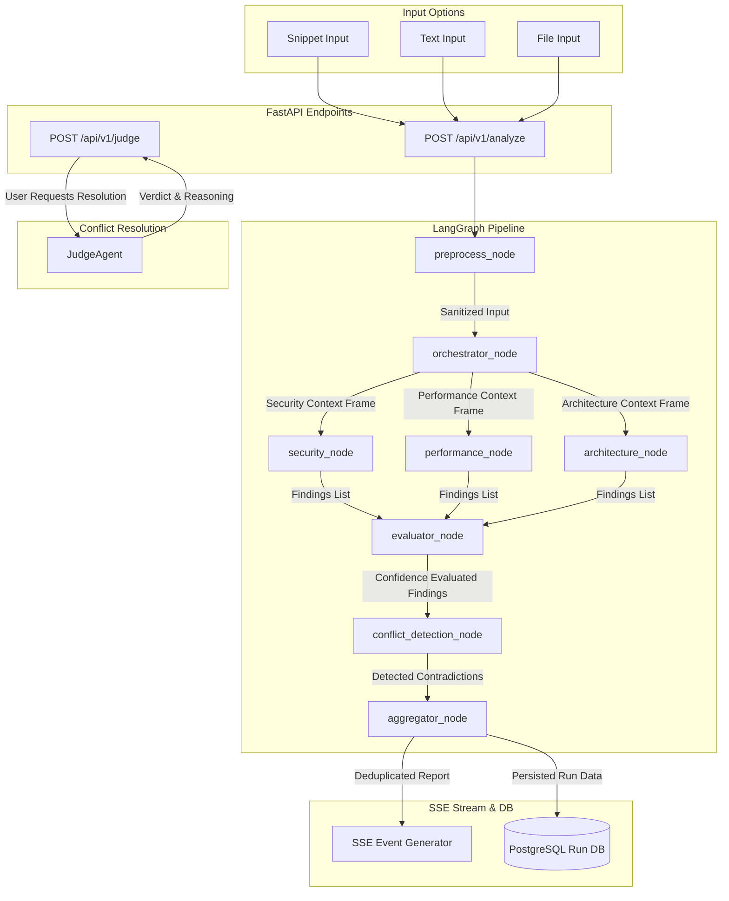

# Anviksha — Multi-Agent Code Review System

**अन्वीक्षा** (Sanskrit) — *Critical inquiry. Systematic examination.*

<!-- Add live demo URL when deployed -->

---

## What Is This Repository?

This is the **public engineering documentation** for Anviksha — a multi-agent code review system that runs specialist AI agents in parallel, detects conflicts between their findings, and optionally resolves contradictions via a judge agent.

The full private codebase is not public. This repository documents the architecture, agent design, engineering decisions, and patterns in depth.

> **Who is this for?** Engineers evaluating system design depth, engineering managers reviewing technical judgment, or anyone curious about production-grade multi-agent orchestration with LangGraph and FastAPI.

---

## The Problem This Solves

Single-model code reviews collapse security, performance, and architectural critiques into a single, generic voice, which masks domain-specific priorities and introduces blind spots. Without isolated expertise, the reviewer struggles to balance trade-offs, often missing cross-cutting vulnerabilities or recommending optimization strategies that directly break security bounds. Standard static analysis tools lack the semantic intelligence to explain the *why* behind their alerts, while simple LLM prompts offer no confidence indicators and fail to flag when their suggestions are mutually exclusive. Anviksha decouples this process into specialized, adversarial agents that inspect code in parallel, score findings for accuracy, and surface logical contradictions before they reach production.

---

## System Overview

Below is the complete stateful execution pipeline modeled within Anviksha:

---

## How It Works

### 1. Orchestrator Contextualization
The orchestrator does not simply pass the raw code input to downstream agents. Instead, it performs a structural pass to determine language, framework, and domain targets, creating localized **context frames** (system instructions). These frames are prepended directly to the specialist prompts. This prevents domain bleed, keeps security agents focused on security (and not refactoring class structures), and forces specialized, highly targeted code inspection.

### 2. Parallel Agents & Blind Evaluation
The three specialist agents (Security, Performance, Architecture) execute in parallel along non-blocking graph edges. Once their outputs land, they are combined and passed to the **Evaluator Agent**. The Evaluator scores each finding on relevance, accuracy, actionability, and severity. To mitigate self-evaluation bias, this is a **blind evaluation**: the Evaluator evaluates a flat index of findings without knowing which agent generated which finding. Findings scoring below $0.6$ are shown with a low-confidence warning badge rather than being silently filtered, maintaining transparency.

### 3. Conflict Detection & On-Demand Judge
The **Conflict Detection Agent** compares findings to locate genuine logical contradictions (cases where acting on one recommendation physically prevents or violates the other). Rather than wasting tokens in an infinite debate cycle during the initial analysis, the system delegates this to a post-hoc, **on-demand Judge**. The user views the conflicting recommendations side-by-side and toggles the Judge, which acts as a post-hoc arbitrator, delivering a clear verdict and comprehensive, logic-based technical reasoning.

---

## Agent Pipeline

| Stage | Agent | Role | Output |
|---|---|---|---|
| **1** | **Preprocess** | Sanitizes user inputs to remove metadata and blocks prompt injection. | Clean code string. |
| **2** | **Orchestrator** | Performs language, framework, and domain target contextualization. | Customized context frames for downstream specialists. |
| **3a** | **Security Agent** | Inspects code for injection, hardcoded credentials, and crypto vulnerabilities. | `AgentOutput` JSON (Findings list matching standard schema). |
| **3b** | **Performance Agent** | Scans for database N+1 loops, memory leaks, and async CPU blocks. | `AgentOutput` JSON (Findings list matching standard schema). |
| **3c** | **Architecture Agent**| Critiques SOLID violations, tight coupling, and class cohesion. | `AgentOutput` JSON (Findings list matching standard schema). |
| **4** | **Evaluator** | Performs blind confidence-scoring on all findings across four dimensions. | `EvaluationOutput` (confidence scores & low-confidence flags). |
| **5** | **Conflict Detection**| Identifies logical contradictions and mutually exclusive instructions. | `ConflictResult` (conflicting pairs & contradiction descriptions). |
| **6** | **Aggregator** | Deduplicates findings, sorts by severity, and packages run metrics. | `AggregatedReport` (persisted to DB + streams final SSE event). |
| **7** | **Judge (On-demand)**| Arbitrates logical contradictions, choosing the safer, superior action. | `JudgeVerdict` (verdict choice + explicit reasoning). |

---

## Tech Stack

| Layer | Technology | Why |
|---|---|---|
| **Orchestration** | LangGraph | Graph-based orchestration allowing parallel execution fan-outs, sequential fan-ins, state serialization, and a highly modular path config. |
| **Backend Framework** | FastAPI | High-throughput asynchronous performance, built-in lifespan controls, and seamless validation integrations. |
| **Language Runtime** | Python 3.11+ | Support for modern type hints, robust async event loops, and native compatibility with standard AI packages. |
| **Database** | PostgreSQL | Enterprise-grade relational storage for managing runs, structured findings, and hashed user credentials. |
| **ORM** | SQLAlchemy (Async) | Fully non-blocking async DB sessions preventing I/O pooling bottlenecks from stalling the FastAPI event loop. |
| **Migrations** | Alembic | Structured, declarative database schema tracking and migration scripts. |
| **Data Validation** | Pydantic v2 | Extremely fast C-compiled data validation enforcing strict inputs and outputs at the agent boundaries. |
| **Real-time Push** | sse-starlette | Unidirectional streaming of pipeline steps in real time, drastically lowering user-perceived latency. |
| **Primary Inference**| Groq (llama-3.3-70b) | Exceptionally low-latency inference (200+ tokens/sec) providing fully completed multi-agent analysis in under 5 seconds. |
| **Authentication** | AuthShield | A decoupled, shared-secret token service that keeps core authentication logic separate from the review engine. |
| **Frontend Framework**| Next.js 15 | Modern App Router supporting Server Component defaults, fast client hydration, and clean route parameters. |
| **Styling & UI** | Tailwind CSS & shadcn/ui| Curated dark-theme palettes, smooth glassmorphism, responsive flex layouts, and custom micro-animations. |

---

## Demo

<!-- Add demo GIF here: record a full analysis run showing parallel agents, conflict detection, and judge toggle -->
<!-- Suggested tool: Kap (macOS) or ScreenToGif (Windows) -->
<!-- Target length: 30-45 seconds showing the full pipeline -->

<!-- Add screenshots here after deployment -->

### Running Locally

Clone the private repo (access required) or use the sample inputs below to test the live demo at [live URL].

Sample inputs that produce interesting results:
- [sql-injection.py](demo/sample-inputs/sql-injection.py) — triggers Security critical + Performance warning conflict
- [n-plus-one.py](demo/sample-inputs/n-plus-one.py) — triggers Performance critical finding
- [tight-coupling.py](demo/sample-inputs/tight-coupling.py) — triggers Architecture critical + conflict with Performance

---

## Documentation

| Document | Description |
|---|---|
| [System Architecture](docs/system-architecture.md) | Deep dive into backend-frontend separation, LangGraph configurations, and real-time streaming pipelines. |
| [Multi-Agent Design](docs/multi-agent-design.md) | Explains the philosophy of specialist isolation, orchestrator steering, and adversarial agent behaviors. |
| [Evaluator Design](docs/evaluator-design.md) | Architectural layout of the blind LLM-as-a-Judge, scoring dimensions, and confidence boundaries. |
| [Conflict Detection](docs/conflict-detection.md) | Technical explanation of how contradictions are identified and how the on-demand Judge arbitrates. |
| [Database Design](docs/database-design.md) | Table-by-table schema models, UUID configurations, and async session handling designs. |
| [API Reference](docs/api-reference.md) | Formal specifications for endpoints, query schemas, and Server-Sent Event payload sequences. |
| [Roadmap](docs/roadmap.md) | Core V1 deliverables and detailed planning for intelligent routing, debate modes, and IDE integrations. |

---

## Code Samples

| File | Pattern Demonstrated |
|---|---|
| [base-agent.py](code-samples/base-agent.py) | Abstract base class featuring lazy client loading, exponential backoff retries, and schema fallback mechanics. |
| [langgraph-graph.py](code-samples/langgraph-graph.py) | Full compilation of the stateful LangGraph mapping out parallel fan-outs and sequential pipelines. |
| [evaluator-agent.py](code-samples/evaluator-agent.py) | Blended multi-agent evaluation parsing scores blindly and calculating composite confidence. |
| [conflict-detection-agent.py](code-samples/conflict-detection-agent.py) | Semantic parsing of agent outputs searching for mutually exclusive instructions and actions. |
| [sse-streaming.py](code-samples/sse-streaming.py) | Asynchronous generator streaming LangGraph state outputs progressively to the client. |

---

## Key Engineering Decisions

1. **Stateful LangGraph over Raw `asyncio.gather`**
   While raw `asyncio.gather` is simple, it lacks state encapsulation, step tracing, and cyclical routing. LangGraph wraps our execution inside a formal, compiled state machine (`GraphState`), enforcing non-blocking parallel fans (Security, Performance, Architecture) and cleanly collecting outputs into structured, sequential nodes for evaluation and conflict detection.

2. **Evaluator BEFORE Conflict Detection (not after)**
   Logical contradictions (conflicts) should only be evaluated on legitimate, high-confidence issues. By executing the Evaluator node first, we filter/flag inaccurate or out-of-domain noise. The Conflict Detection node then processes a clean list of evaluated findings, reducing logical false conflicts and saving downstream tokens.

3. **Post-Hoc Judge (not inline multi-agent debate in V1)**
   Inline multi-agent debate (agents arguing with one another in a loop before packaging a response) adds major token overhead and blocks the user's streaming response for 30+ seconds. Delegating conflict resolution to an on-demand, post-hoc Judge allows users to view findings immediately and only pay the latency/token cost of a Judge when they explicitly request it.

4. **Groq as Default Provider**
   To make a multi-agent pipeline production-ready, sub-second latency is mandatory. By leveraging Groq's high-speed LPU inference engine, all three specialist agents, the evaluator, and the conflict detector execute and compile findings sequentially in under 5 seconds, avoiding a lengthy, blocking loading state.

5. **Contextualization over Routing in V1**
   Instead of routing input to only one agent, Anviksha sends it to all three specialists but steers them with context frames. Complex scripts often contain overlapping concerns (e.g., a database query might be highly insecure *and* structurally slow *and* poorly modularized). Context framing keeps agents focused on their domains without missing cross-cutting flaws.

6. **SSE over WebSockets**
   Unidirectional streaming is sufficient since the pipeline is a request-response flow with a long-running, chunked execution. WebSockets introduce complex connection handshake logic, keep-alive overhead, and stateful socket management. SSE leverages clean HTTP with standard automatic reconnection and simple client-side event listeners.

---

## V2 Roadmap

| Feature | Description |
|---|---|
| **Intelligent Agent Routing** | Orchestrator determines which agents are relevant per input, skipping irrelevant ones using LangGraph conditional edges. |
| **Debate Mode** | When conflicts are detected, agents exchange rebuttals (max 2 rounds) before the Judge resolves, using rebuttal edges in the graph. |
| **Additional Agents** | Introduces a Clean Code Agent (unused variables, magic numbers) and a Reliability Agent (missing error catches, unhandled calls). |
| **Git CI/CD Integration** | Webhook-triggered reviews of changed files per commit, posting findings as inline PR comments via the GitHub Checks API. |
| **User Authentication** | User signups/logins (via AuthShield integration), saving persistent custom API keys and custom scanning rules. |
| **Report Persistence & Dashboard**| Full run histories per user, trend charts (tracking critical findings over time), and cross-run comparison dashboards. |
| **Stronger Judge Model** | Upgrades the Judge Agent to a larger, reasoning-capable model (`JUDGE_MODEL`) via simple configuration. |
| **IDE Plugin** | VS Code extension highlighting findings as inline squiggles, supporting right-click "Analyze with Anviksha". |

---

Built with precision. Designed for production.

Private codebase available for review during interview process.
