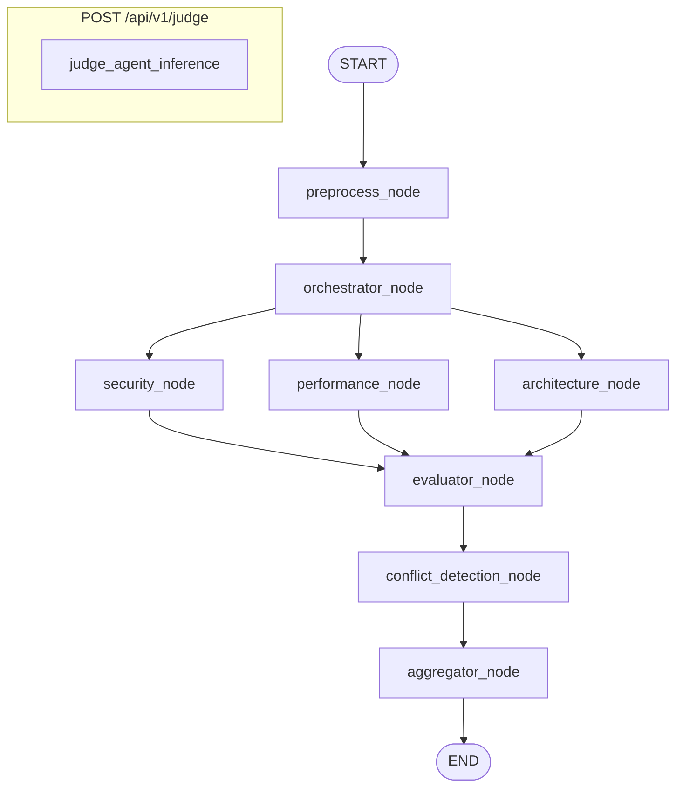

# LangGraph State Machine Graph

This diagram illustrates the compiled, stateful node graph managed by **LangGraph** inside the Anviksha backend. 

### Why LangGraph?

Instead of relying on rigid, raw `asyncio.gather` scripts, LangGraph provides:
1. **Shared State Management:** State transitions are verified by a central `GraphState` TypedDict, which serializes easily for audit logging or session debugging.
2. **First-Class Parallelism:** Declaring multiple incoming and outgoing edges automatically creates non-blocking parallel fans and clean synchronized wait states (joins) without writing manual asynchronous locking logic.
3. **High Extensibility:** Adding a new specialist agent or a debate stage in V2 requires adding nodes and routing edges without restructuring the underlying pipeline logic.

