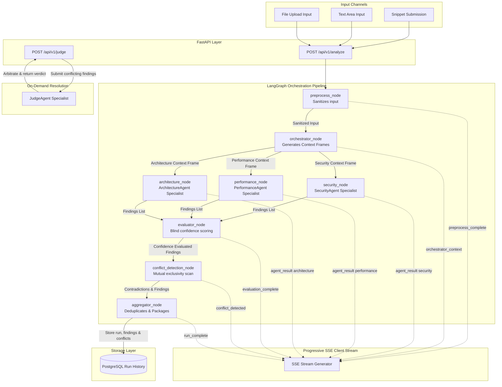

# System Pipeline Flow

This diagram illustrates the end-to-end execution flow of an Anviksha code analysis session. It maps out how a raw code submission traverses input parsing, orchestrator steering, parallel specialist evaluation, conflict detection, real-time SSE push, and the separate, on-demand Judge path.

