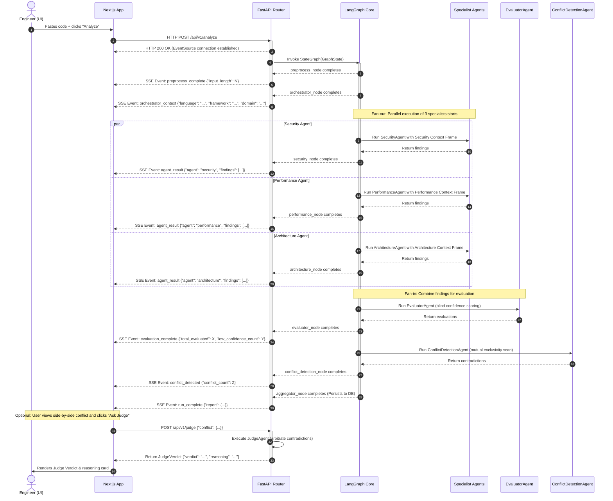

# Server-Sent Events (SSE) Sequence

This sequence diagram illustrates the asynchronous execution and event-push lifecycle of Anviksha. To minimize user-perceived latency, findings are progressively rendered in the Next.js UI as their respective nodes finish, rather than blocking the screen until the entire pipeline terminates.

