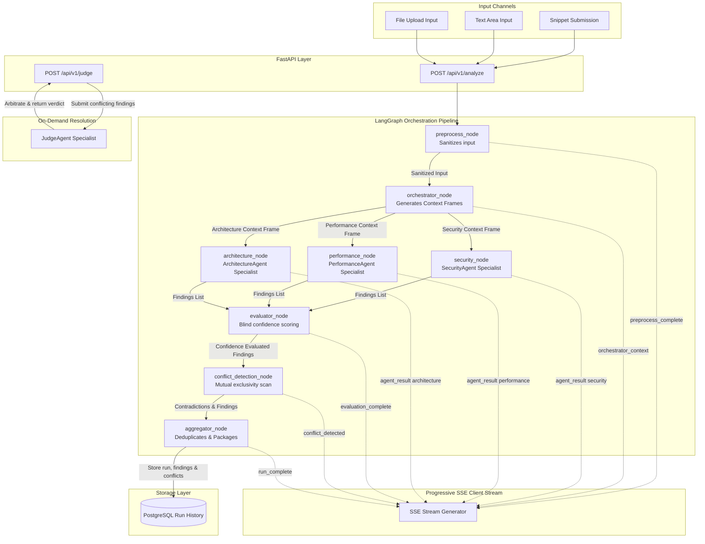
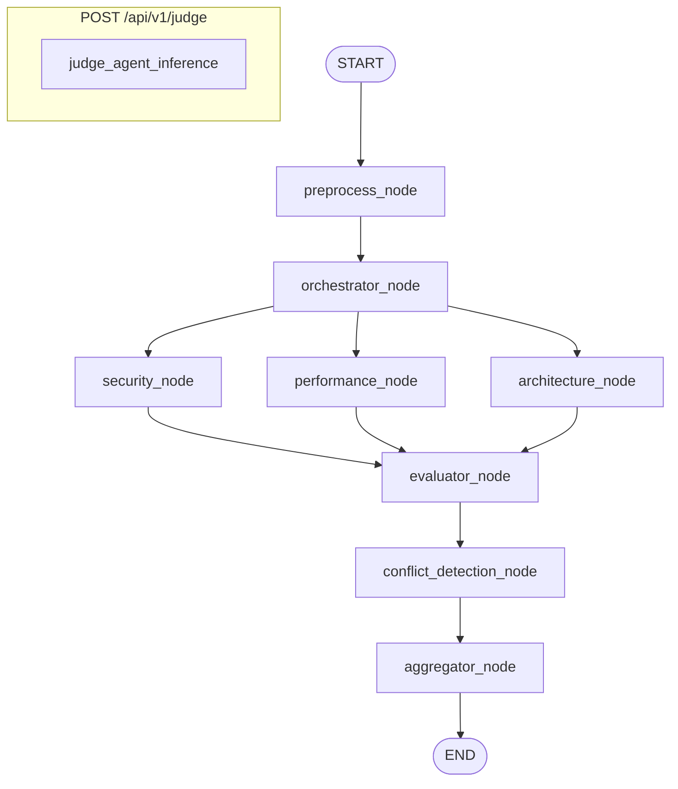
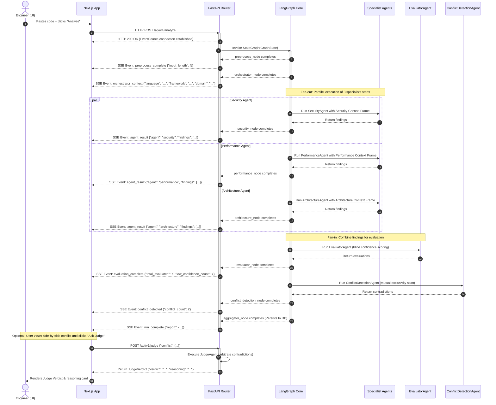

# System Architecture

Anviksha is built on a modern, decoupled **async Python FastAPI backend** and a responsive **Next.js 15 App Router frontend**. The core execution logic is modeled as a stateful, compiled graph using **LangGraph**, persisting run states and findings to a relational **PostgreSQL** database. 

This document details the engineering patterns, service separations, and performance strategies used to construct Anviksha.

---

## 1. Service Separation

The architecture is strictly split into three isolated services communicating over standard APIs:

1. **Next.js Frontend:** A client-facing Next.js 15 application deployed to Vercel. It implements responsive UI primitives (using Tailwind CSS and shadcn/ui), handles stateful progressive rendering of findings streamed via Server-Sent Events (SSE), and delegates user registration and sign-in requests directly to the AuthShield endpoint.
2. **FastAPI Engine:** An asynchronous Python REST service deployed to Render. It validates incoming review requests, drives stateful LangGraph execution steps, interacts with the PostgreSQL storage layer via async SQLAlchemy sessions, and performs in-flight validation of structured JSON outputs.
3. **AuthShield Microservice:** A centralized, independent authorization server. The Anviksha backend delegates token validation and user registration entirely to this microservice, using a shared JWT cryptographic key. The FastAPI application verifies token signatures and extracts the `user_id` without maintaining local password hashes or session stores.

---

## 2. Full Pipeline Flow

The execution cycle begins when the client submits code for review. The diagram below illustrates how raw inputs traverse the backend system:

---

## 3. LangGraph Orchestration & Parallel Execution

Rather than chaining LLM calls in simple, sequential scripts (which increases overall request duration and lacks clear step tracking), Anviksha models its pipeline as a compiled **StateGraph**.

### Performance Advantages:
- **Asynchronous Concurrency:** The Security, Performance, and Architecture nodes execute concurrently on non-blocking graph edges.
- **State Isolation:** Each node receives a read-only snapshot of the shared `GraphState` TypedDict and returns only the keys it modifies. This prevents in-place mutation side-effects and simplifies debug tracing.
- **Robust Exception Barriers:** A failure or structural schema breakdown inside one agent is captured by local try/except blocks in its respective node. The error is written to the state, and the graph safely proceeds with the remaining agents, preventing a single rate-limit error or formatting issue from crashing the entire user session.

---

## 4. Server-Sent Events (SSE) Streaming Strategy

Because multi-agent analysis involves running multiple large LLM queries, waiting for all nodes to complete before showing any results creates a blocking, slow user experience. 

Anviksha uses **Server-Sent Events (SSE)** via `sse-starlette` to stream findings progressively. As soon as the Security agent completes, its findings are serialized to JSON and pushed to the client immediately. The Next.js application catches these events and appends them to a stateful UI list in real time, making the application feel responsive and alive.

---

## 5. Persistent Storage Layer

To support run history dashboards and allow manual Judge arbitration, all run metadata, structured findings, and logical conflicts are persisted in a PostgreSQL relational schema. 

We use **SQLAlchemy 2.0 Async Session** mapping with a non-blocking `asyncpg` driver to execute database I/O. This ensures that slow database queries or concurrent user writes never block FastAPI's primary single-threaded event loop.

---

## 6. Cold Start and Deployment Details

The system is deployed across three environments:
1. **Frontend (Vercel):** Hot-reloaded React codebases directly talking to the Render API endpoints.
2. **Backend (Render):** Deployed on a free-tier instance. The free tier automatically sleeps after 15 minutes of inactivity. When a slept server receives its first request, a ~30-second "cold start" latency is expected as Render rebuilds and starts the uvicorn process. To mitigate db connection drops after waking up, the SQLAlchemy engine is configured with `pool_pre_ping=True` to test connections in-flight.
3. **Database (Neon Postgres):** Deployed on Neon serverless PostgreSQL, configured with `pool_recycle=300` to recycle stale database connections safely.
